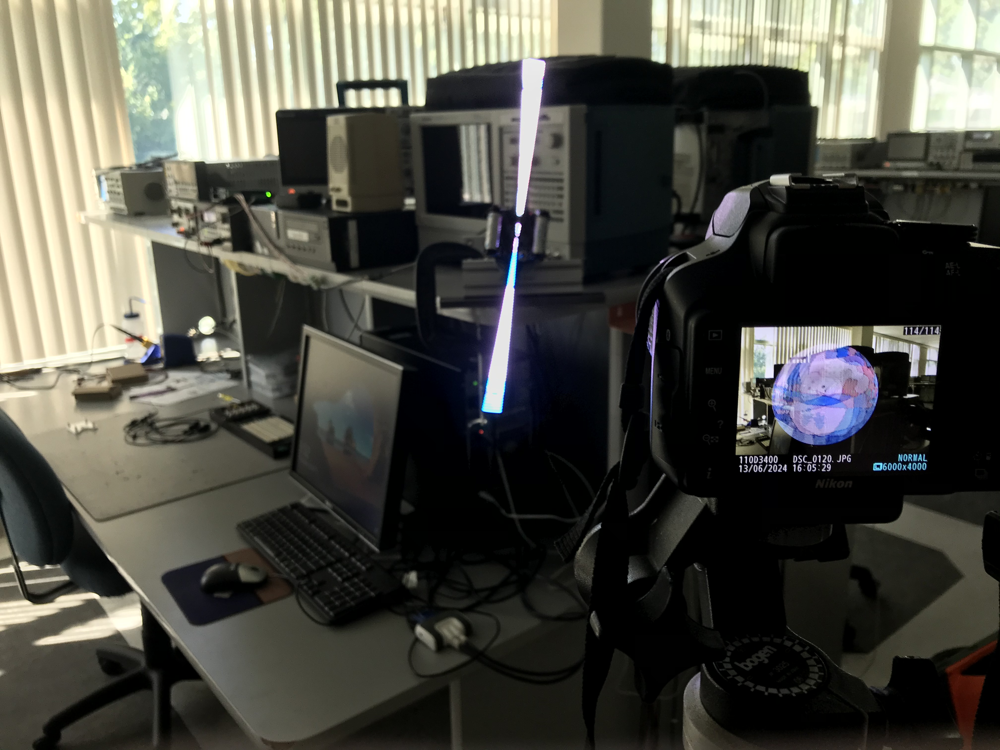

# Project
## Ethan Jansen - 6/14/2024

Unlike the proposed design in class, my project designs around the LED update period (including both the 960$\mu$s DMA time and the reset period).
Initially I chose this approach because it would allow me to update the LEDs as quickly as possible while ensuring I followed the LED timing requirements.
This, however, required that my design was asynchronous to the gyroscope/accelerometer.
So instead of basing all my updates according to the INT1/INT2 IMU interrupts, I would manually pull the data I needed whenever I was ready for it during the LED reset period.
It turned out, however, that minimizing the LED reset period prevent the LEDs from updating fully in a desirable manner.
Thus, while my design was just as slow as everyone else's (due to the hardware limitation), it did allow me to more easily (I felt) control the reset period.
This was because I controlled the reset period from a PIT (basically) without any harder-to-calculate CPU time in between the DMA time and the reset period.

As an overview, each LED update period includes the following:

 - DMA, triggered by the TPM 0/1 LED signals, sends the data to the LEDs for the next frame for 960$\mu$s.
 - After the DMA completes, the TPM is turned off and a PIT is started to begin the reset period (ultimately I configured the PIT to interrupt after ~3ms, though theoretically this could be done from anywhere between 300$\mu$s to 10ms which produced the best results but was too slow).
 -  At the beginning of the reset period, the gyroscope Z data (GyroZ) was read over SPI, a new frame number was calculated based off GyroZ, and the frame was swizzled for the next DMA.
 -  After the PIT expired it was stopped until the next cycle, DMA was reconfigured, and the TPM signals were reenabled for the next cycle.

The implementation of this design takes place primarily within the [DLEDS](/src/DLEDS.cpp) class, while the helper classes [DMOTION](/src/DMOTION.cpp) (with [DSPI](/src/DSPI.cpp)), [DTPM](/src/DTPM.cpp), [DDMA](/src/DDMA.cpp), [DPIT](/src/DPIT.cpp), and [DGPIO](/src/DGPIO.cpp) were used to read GyroZ, generate LED signals, send LED data, manage LED reset period, and configure I/O, respectively.
Most of these helper classes are as they were in previous labs, however the [DMOTION](/src/DMOTION.cpp) class was updated to support only reading GyroZ with a correction factor and no longer includes INT1/INT2 initialization steps.

[```DLEDS::init```](/src/DLEDS.cpp#L22) is called directly from ```main``` and everything afterwards is part of an interrupt handler. The ```init``` process swizzles the first frame, initializes the helper classes, and sets the interrupt priorities.
The PIT is given the lowest priority to ensure everything necessary happens during the reset period (this is not an issue as the reset period is relatively long).
Also, SPI is given a priority higher than DMA as the SPI request for GyroZ is made from within the DMA interrupt handler--which requires preemption.

As previously mentioned, the LED reset period is quite long due to unfortunate hardware limitations.
Because of this, all other CPU operations take place during the reset period and nothing happens during the DMA transfer to the LEDs.
The reset period begins with [```DLEDS::startLEDReset```](/src/DLEDS.cpp#L54) which is a called from the DMA interrupt handler and ends with [```DLEDS::stopLEDReset```](/src/DLEDS.cpp#L75) which is called by the PIT interrupt handler.
[```DLEDS::stopLEDReset```](/src/DLEDS.cpp#L75) is simple only stopping the PIT and starting the TPM and DMA.
[```DLEDS::startLEDReset```](/src/DLEDS.cpp#L54) is more complicated, however. After stopping DMA and the TPM, and starting the PIT, the GyroZ data is read with SPI.
Currently, this read is blocking which is not great to have within an interrupt handler.
This should not be too difficult to resolve as my [```DMOTION::getGyroZFromZSPI```](/src/DMOTION.cpp#L113) already supports a non-blocking call, I would just need to make the call to [```DMOTION::getGyroZFromZSPI```](/src/DMOTION.cpp#L113) early enough to ensure I do not need the GyroZ data until after the transmission is complete.
After getting new GyroZ data, an internal angle counter ```_angle``` is updated and a new frame is calculated; this takes place in [```DLEDS::getFrame```](/src/DLEDS.cpp#L86).
After this, the next frame is swizzled (and automatically flipped if necessary from within [```DLEDS::swizzle```](/src/DLEDS.cpp#L134) without requiring an additional buffer), and placed in the DMA buffer to be read after the reset period.

[```DLEDS::getFrame```](/src/DLEDS.cpp#L86) calculates the next frame by first updating the internal ```_angle``` counter.
The GyroZ data used is at a sensitivity of $\pm$ 500dps at the extreme values of a signed 16bit integer.
This means that a GyroZ value of 65534 corresponds to a rotational velocity of $\omega=1 \frac{\text{degree}}{\text{ms}}$ (and if I understand correctly a value of -65536 corresponds to $\omega=-1 \frac{\text{degree}}{\text{ms}}$).
In order to maintain fractional values to prevent compounding error, and to avoid integer rounding, the angle in degrees, $\theta$, is calculated as
$$2^{16}\theta=T\left(\frac{2^{16}\text{GryoZ}}{65534}\right)$$
if $\theta>0$, or simply as
$$2^{16}\theta=T\text{GyroZ}$$
if $\theta\leq0$, where $T$ is the full LED update period.
$\theta$ is then added to ```_angle``` and ```_angle``` is kept between $\pm360*2^{16}$.
From here a frame can be computed as
$$\text{\_frame}=\bigg\lvert\frac{\text{\_angle}}{(180*2^{16})/n}\bigg\rvert,$$
where $n$ is the number of frames.
If $\text{\_frame}\geq n$ then, $\text{\_frame}\leftarrow\text{\_frame}-n$ and the ```_reverse``` flag is set making [```DLEDS::swizzle```](/src/DLEDS.cpp#L134) reverse the frame.

While the frame counting and reversing function of [```DLEDS::swizzle```](/src/DLEDS.cpp#L134) have been tested, there appears to be some issue with the ```_angle``` calculation as all POV attempts appear a bit smeared as though there is some phasing issue.
Several other iterations of $\theta$ calculation were tried (except for using ```float```s) and the location of the $\theta$ calculation was tried between the beginning and end of the reset period, but to no avail.
A period of $T=4$ is being used to approximate the measured 3.99$\mu$s period so it is possible this is creating some compounding error.

Here are a few miscellaneous design notes which have not yet been mentioned:

 - A gyroscope ODR of 833Hz is being used as a rate much greater than that appeared to increase the GyroZ error. This error was not static and could not easily be resolved with a correction factor.
 - At an ODR of 833Hz, a correction factor of 39 added to the GyroZ appears to eliminate most offset error.
 - With the added project complexity, a SPI clock of 1MHz is being used as the interrupt handler appeared to be too lengthy for 4MHz and led to issues.
 - The PIT used to control the LED reset period is set to interrupt at 333Hz when activated (it only ever interrupts once before being deactivated before the next cycle).
 - [DLEDS](/src/DLEDS.cpp) supports a variable number of frames and has been tested (somewhat successfully) using both 120 and 150 frames.
 - At 150 frames of resolution there is only 108B free of flash. This is because I have not fully stripped out unnecessary stuff from previous labs, but indicates that the ~500B saved by implementing reversing in [```DLEDS::swizzle```](/src/DLEDS.cpp#L134) paid off.
 - DMA is configured to transfer 768 bytes from the data buffer to the GPIO. This is triggered by the TPM LED 1 signal channel match. Originally I was able to do this (just barely) with TPM overflow, but with a DMA latency of ~270ns it would likely have caused issues.
 - TPM2 is used to create a PWM signal at 800kHz (for 1.25$\mu$s bits) with a duty cycle of 20% for an LED 0 signal, and a duty cycle of 52% for an LED 1 signal. These were measured to ensure it met the LED specifications.

The project was originally, and successfully, tested with a static PIT-controlled frame counting to ensure viability.
It was finally tested, with all gyroscope/angle/frame updating, and managed to produce the below image.
It is "decent" and shows that the design is promising, however the previously mentioned phasing issue is apparent.

During this project, I had the idea that rather than picking which frame to display over a static cycle period I could dynamically adjust the reset period (and by extension the cycle period) based on the GyroZ data.
I think this is promising, and maybe even easier (famous last words), however I realized that this would likely create response issues when starting from a standstill as the PIT would be extended to the max.
Likely a best approach would be to combine the two designs: dynamic cycle periods and frame number calculation.
However, this is left as an alternative design for possible future work.


